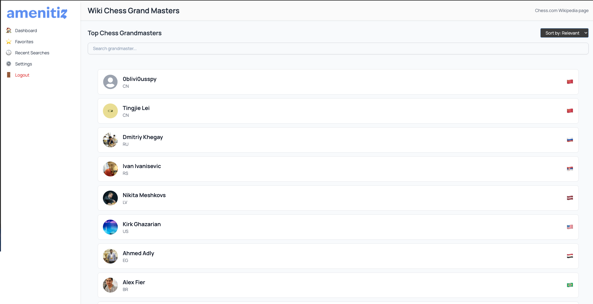
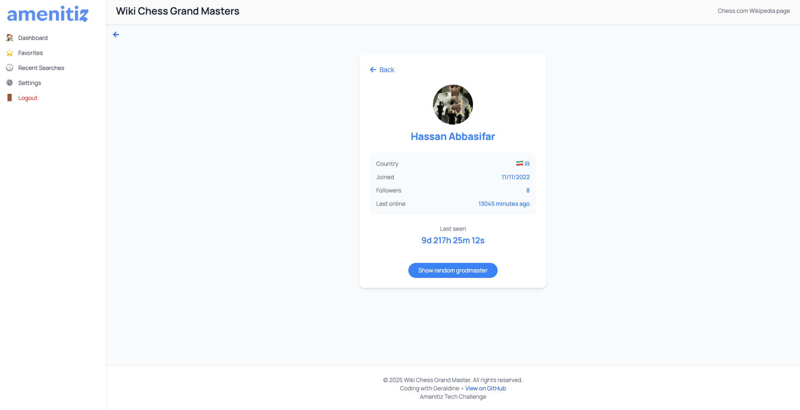

# ♟️ Chess Grandmasters Wiki – Frontend Coding Challenge

A responsive web app built with **React 19 + TypeScript + TailwindCSS** that lists Chess Grandmasters using the [Chess.com Public API](https://www.chess.com/news/view/published-data-api).  
Users can explore grandmasters, view their profiles, sort and search through the list, and track when they were last online in real time.

---

## 🧠 Overview

This project was built as a frontend technical challenge for Amenitiz. It simulates a Wikipedia-style interface where users can:

- Browse a paginated list of chess grandmasters
- Search by username
- Sort players by join date
- View a profile with real-time "last seen" tracking
- Navigate between list and profile views

---

## ⚙️ Tech Stack

| Tech            | Description                                      |
|-----------------|--------------------------------------------------|
| **React 19**    | UI library for building component-based views    |
| **TypeScript**  | Static typing for better dev experience          |
| **TailwindCSS** | Utility-first styling framework                  |
| **Vite**        | Fast build tool and dev server                   |
| **React Router**| Page navigation                                  |
| **Chess.com API** | Public data for grandmasters and player info  |

---

## 📁 Folder Structure
src/
- components/ # Reusable UI components (Cards, Header, Sidebar, etc.)
- pages/ # Main pages (GrandmasterProfilePage, GrandmasterPage)
- services/ # API request logic
- types/ # TypeScript interfaces for player data and DTO
- utils/ # Utility functions (e.g., flag emoji, country code parsing)
- App.tsx # Main layout and router outlet
- main.tsx # Entry point for React app


---

## ⚖️ Trade-offs & Design Decisions

- **API structure**: The Chess.com API does not provide full player data in bulk, so we used `Promise.allSettled()` to ensure waits for all promises to complete, regardless of success or failure, we get a result for every request either 'fulfilled or rejected'. This approach ensures flexibility but could be optimized with server-side caching in a production app.
- **Pagination logic**: We chose client-side pagination for simplicity, slicing the sorted and filtered data locally.
- **Country flags**: We manually converted country codes to emoji flags using a Unicode approach for visual flair without additional dependencies.
- **No state management library**: We managed app state via `useState` and `useEffect` to avoid unnecessary complexity.

---

## 🚀 Running the Project

### Prerequisites

- Node.js v18+
- Git

### 📈 Future Improvements & TODOs

✅ Improve pagination UI with ellipsis logic

 Add unit tests (Jest + Testing Library)

 Add error boundaries and better fallback UI

 Implement debounce on search input

 Add responsiveness enhancements and mobile optimizations

 Include filters by country or followers

 Implement server-side rendering (SSR) with Next.js for SEO (optional)

### Dashboard


### Profile Page


### Setup

```bash
# Clone the repository
git clone git@github.com:chicacode/amenityz-challenge.git

# Navigate to the folder
cd amenityz-challenge

# Install dependencies
npm install

# Start development server
npm run dev

Open http://localhost:5173 in your browser.


✨ Demo
This project was made by Geraldine as part of a frontend coding challenge.

Made with 💙 by @chicacode
📌 
